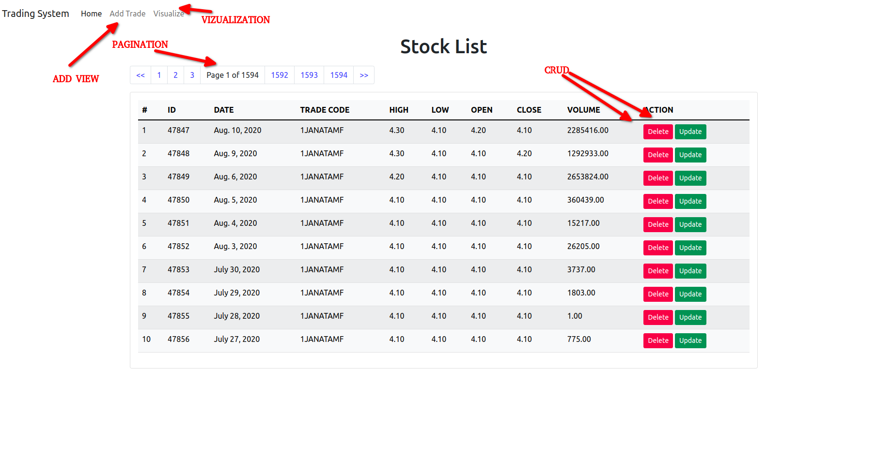
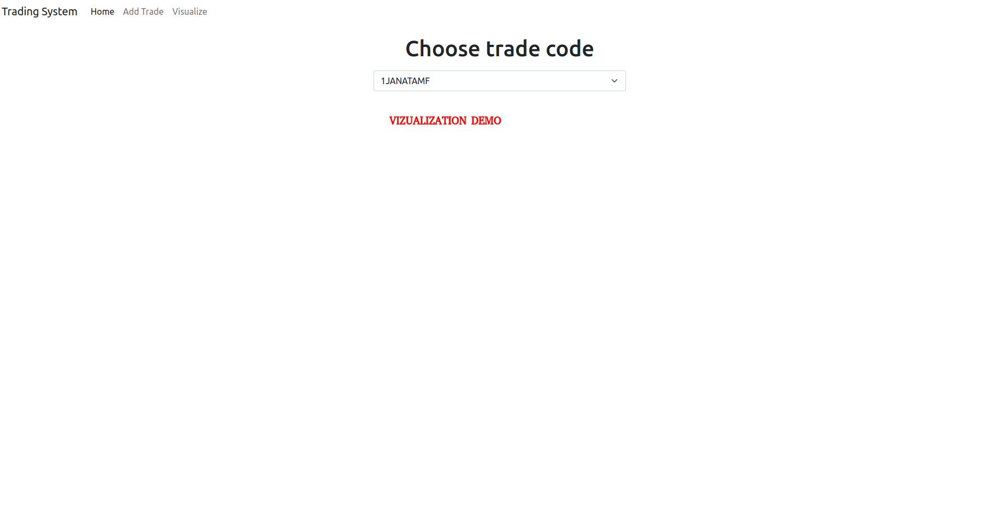
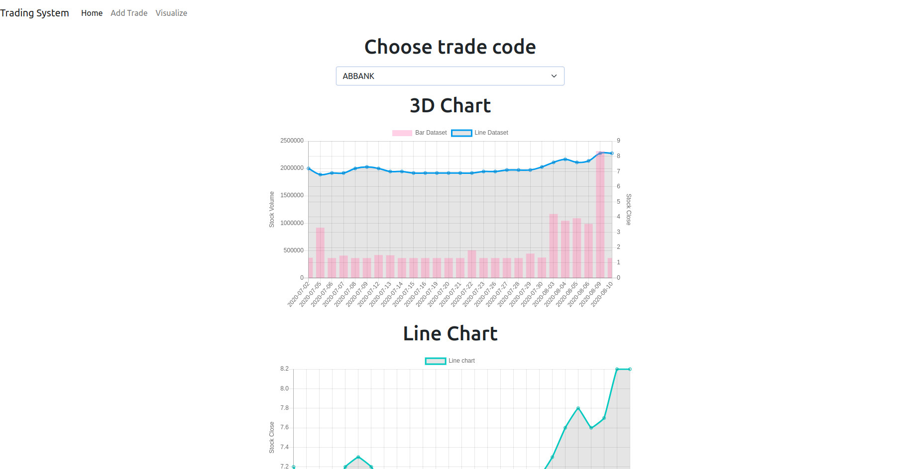
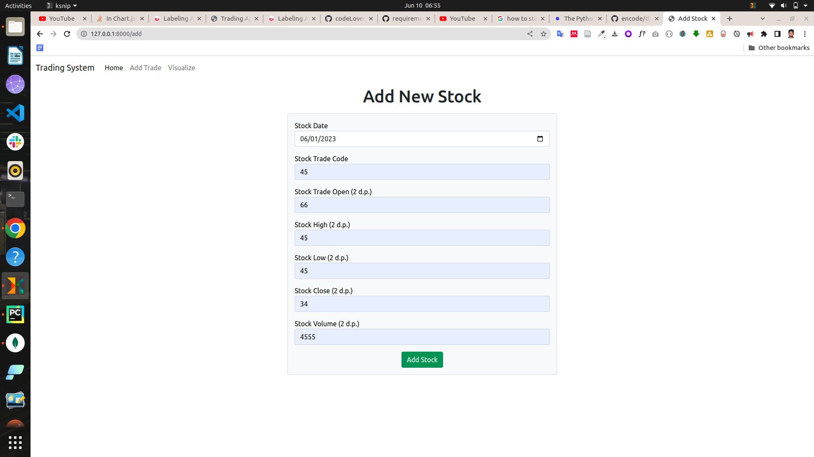
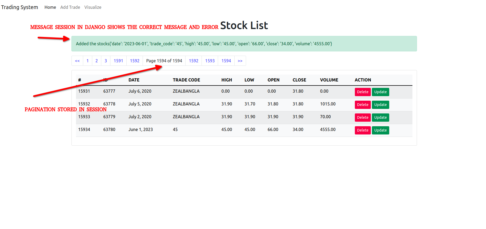

# INSTALLATION INSTRUCTIONS

1. python3 -m pip install -r requirements.txt

2. python3 manage.py makemigrations

3. python3 manage.py migrate

4. python3 manage.py seed

5. python3 manage.py runserver

# ABOUT MYSELF AND THE PROJECT

1. I've learnt Python programming language in University 1st year, but I have 6 months' internship experience as 
fullstack React Node.js intern and 2 months' Spring Boot developer internship.
2. First time in my life using Django or any Python framework. I really loved it, and the documentation 
and developer community are quite amazing.
3. If you can't install the project, please email mjrrdn@gmail.com or contact
+8801952996432 via Whatsapp. I am not a Python developer, and I am using it first time in 3 years, so sorry for mistakes.
4. Features of the project: visualization by Chart.js, pagination, command, session, message, CRUD, validation, etc. etc. standard fullstack things
using Django framework

# DEMO

